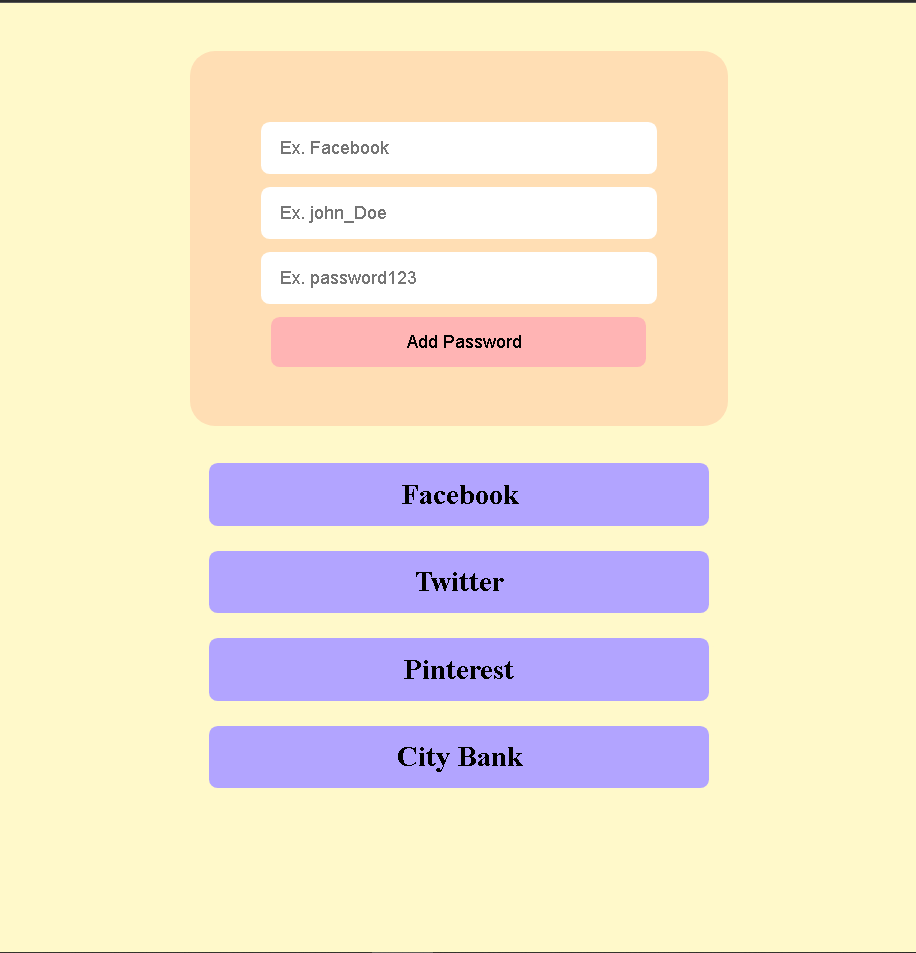
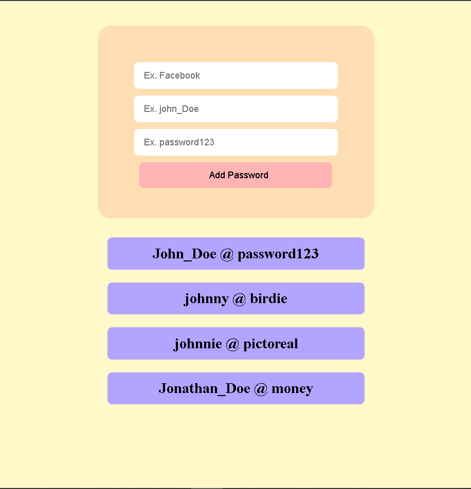

# Password Manager

Web Application to store login Id and passwords securely in encrypted form. \
Can be used to store, retrieve and encrypt passwords.




### Tools and Libraries used

---

Nodejs, Reactjs, MYSQL, Expressjs, Crypto

### To run the Application Client

```
$ cd client
$ npm start
```

### To run the Applicatio Server

```
$ cd server
$ npm start
```

### Configurations

-   For Client, update the config.json file
-   For Server, update the .env file
